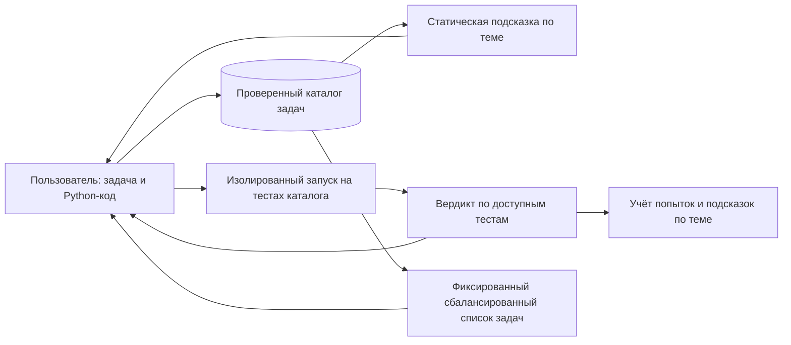
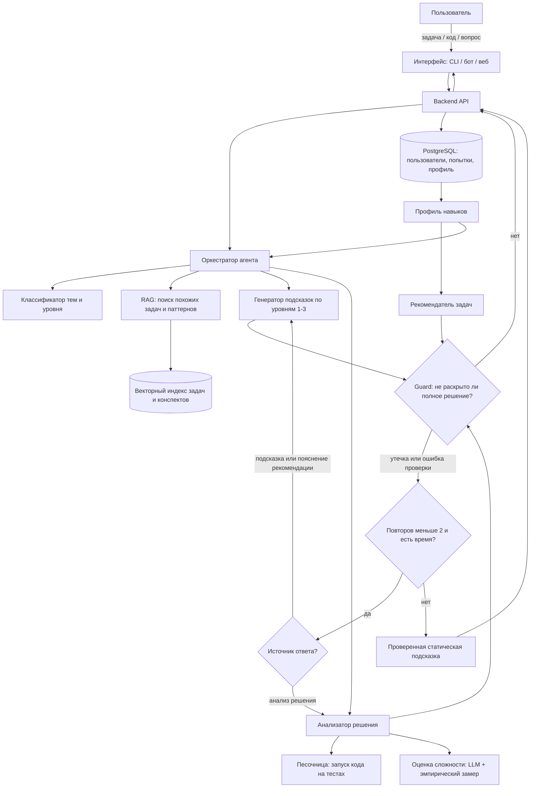

# ML System Design Doc — AlgoMind

> Версия 0.2
> Нумерация: [шаблон Reliable ML](https://github.com/IrinaGoloshchapova/ml_system_design_doc_ru/blob/main/ML_System_Design_Doc_Template.md). Параметры пилота — плановые допущения до набора участников.

## 1. Цели и предпосылки

### 1.1. Зачем идём в разработку продукта?

#### Бизнес-цель

Подготовка к алгоритмическим секциям собеседований (LeetCode-подобные задачи) - массовая потребность разработчиков. Существующие подходы имеют системные проблемы:

| Подход | Проблема |
|---|---|
| Решебники / разборы на LeetCode, YouTube | Читаешь готовое решение -> иллюзия понимания, навык не формируется |
| Общий чат-бот (ChatGPT и т.п.) | Выдаёт ответ сразу, не ведёт диалог-обучение, не помнит прогресс, может уверенно ошибаться в сложности |
| Репетитор / менторство | Дорого и плохо масштабируется |
| Самостоятельная практика | Нет обратной связи, непонятно, какие темы проседают |

**Цель продукта:** превратить подготовку из «прочитал ответ» в «понял логику и закрепил навык» — с персонализацией по слабым местам.

#### Почему станет лучше от применения ML

- LLM способна вести **сократический диалог**: оценивать, где пользователь запутался, и давать подсказку нужной глубины — классическими правилами это не закодировать.
- Анализ **произвольного кода пользователя** (идея, баги, граничные случаи, сложность) — задача понимания кода.
- Классификация задач и ошибок по **темам/паттернам** позволяет строить профиль навыков и персональный план.

#### Что считается успехом (продуктовые и ML-метрики)

| Уровень | Метрика | Целевое значение (MVP) |
|---|---|---|
| Продукт | Доля пользователей, решивших задачу самостоятельно с подсказками (без показа полного решения) | ≥ 60 % |
| Продукт | Дополнительный рост решаемости по исходной слабой теме относительно контроля за 2 недели (разность изменений, п. 3.1) | ≥ 15 п.п. |
| Продукт | Retention D7 | ≥ 25 % |
| ML | Точность определения временной/пространственной сложности (на размеченном наборе) | ≥ 85 % |
| ML | Доля подсказок, не раскрывающих полное решение (LLM-judge + ручная проверка выборки) | ≥ 95 % |
| ML | Точность определения темы задачи/ошибки (accuracy по тегам) | ≥ 80 % |
| ML | Доля корректных вердиктов о правильности решения пользователя (с учётом запуска тестов) | ≥ 90 % |

### 1.2. Бизнес-требования и ограничения

#### Бизнес-требования

1. Пользователь вводит условие задачи (текст/ссылка) и получает **пошаговое сопровождение**: уточнение условия -> идея -> структура данных -> алгоритм -> реализация.
2. Уровень подсказки **регулируется**: по умолчанию - наводящие вопросы; полное решение выдаётся только по явному запросу после попыток.
3. Для любого решения пользователя система выдаёт **оценку сложности** (time/space) с обоснованием и указывает более оптимальные подходы.
4. Система хранит историю и строит **профиль навыков** по темам (массивы, графы, DP, жадные, два указателя и т.д.).
5. Система рекомендует **следующие задачи** под уровень и слабые места.
6. Поддержка русского и английского языков, языки кода - Python, затем другие.

**Бизнес-требование к пилоту:** 40 студентов старших курсов и начинающих Python-разработчиков, готовящихся к алгоритмическим собеседованиям; 4 недели, две группы по 20 человек. Проверяем пользу персонального плана относительно контроля: дополнительный прирост ≥ 15 п.п., решаемость с подсказками ≥ 60 %, D7 ≥ 25 %, выполнение порогов качества и бюджета. Процесс и правило решения — п. 3.

#### Бизнес-ограничения

| Ограничение | Значение / допущение |
|---|---|
| Бюджет на инференс | ≤ $0.10 на сессию разбора одной задачи в среднем; расчёт ниже |
| Латентность | p95 времени до показа проверенной подсказки ≤ 15 с; общий дедлайн 15 с, затем статический ответ |
| Команда | учебный проект, 1 разработчик, срок — семестр курса |
| Данные | только открытые/легальные источники условий задач; не копируем закрытые базы платных платформ |
| Приватность | код и история пользователя не передаются третьим лицам, кроме LLM-провайдера; хранение — с возможностью удаления |
| Безопасность | исполнение пользовательского кода только в изолированной песочнице с лимитами CPU/RAM/времени и без сети |
| Надёжность | допустима деградация: при недоступности LLM — отдаём статические подсказки/теги из базы |

#### Оценка стоимости сессии

Сессия — разбор одной задачи, планово 6 ответов. Генератор и guard — Haiku 4.5, $1 / млн входных и $5 / млн выходных токенов ([Claude API pricing](https://platform.claude.com/docs/en/about-claude/pricing), проверено 04.11.2026). Расчёт без скидок за кэширование:

| Вызовы за сессию | Входные токены | Выходные токены | Стоимость |
|---|---:|---:|---:|
| 6 генераций: по 4 000 входных (инструкции, условие, RAG, код, история) и 400 выходных | 24 000 | 2 400 | $0.036 |
| 6 guard-проверок: по 1 500 входных и 100 выходных | 9 000 | 600 | $0.012 |
| Классификация и итоговый анализ суммарно | 5 000 | 1 000 | $0.010 |
| Итого без повторов | 38 000 | 4 000 | $0.058 |

Повторная пара «генерация + guard» стоит $0.008. Две дополнительные пары за сессию дают $0.074; по две на каждый из шести ответов — $0.154. Поэтому исходные $0.05 заменены целью среднего $0.10. Это оценка, не замер: история и код могут быть длиннее. В пилоте считаем все фактические токены, повторы и ошибки, среднее и p95 стоимости; длинные сессии показываем отдельно. Песочница, БД и индекс учитываются отдельно от инференса.

#### Что считается «успешным MVP»

Пользователь решает 3 задачи подряд, получая только подсказки, и после этого видит корректный профиль слабых тем.

#### Риски

| Риск | Митигация |
|---|---|
| Галлюцинации в оценке сложности / ложный вердикт | Проверка решения запуском тестов в песочнице; эталонные решения и сложность для задач из базы; self-consistency |
| «Протекание» полного решения в подсказке | Многоуровневая система подсказок, guard-проверка выхода (LLM-judge), тесты на утечку |
| Задача пользователя вне базы -> нет эталона | Генерация тестов + сверка с несколькими независимыми решениями LLM; пометка «низкая уверенность» |
| Рост стоимости | Кэширование, маршрутизация простых запросов на меньшую модель |
| Небезопасный код пользователя | Песочница (контейнер, seccomp, без сети, лимиты) |

### 1.3. Что входит в скоуп проекта / итерации, что не входит

#### Итерация 1 (MVP, текущая)

**Входит:**
- Диалоговый разбор одной задачи с тремя уровнями подсказок (направление -> идея/структура данных -> псевдокод).
- Разбор решения пользователя на Python: корректность (запуск на тестах), оценка time/space сложности, граничные случаи.
- Базовая база задач (~100–200 задач) с тегами тем, сложностью и эталонной оценкой.
- Простой профиль навыков (статистика попыток и подсказок по темам) и подбор задач по слабой теме для пилота.
- Интерфейс: CLI или Telegram-бот / простое веб-приложение (уточняется).
- Набор для оффлайн-оценки качества (golden set) и отчёт по метрикам.

**Не входит (в этой итерации):**
- Mock-интервью с голосом/видео и оценкой soft skills.
- System design и behavioral-секции собеседований.
- Языки кроме Python.
- Интеграция с LeetCode/Codeforces через API и автоимпорт истории посылок.
- Мобильное приложение, платежи, соцфункции (рейтинги, друзья).
- Дообучение собственных моделей (используем готовые LLM + промптинг/RAG).

#### Дальнейшие итерации (roadmap)

1. Итерация 2: расширение адаптивного плана тренировок, spaced repetition по паттернам.
2. Итерация 3: дополнительные языки, mock-интервью в текстовом формате.
3. Итерация 4: интеграции с внешними платформами, персонализация на основе эмбеддингов задач.

### 1.4. Предпосылки решения

#### Источники данных

| Данные | Источник | Назначение |
|---|---|---|
| Условия, теги, сложность задач | Открытые датасеты (напр. наборы задач Codeforces/открытые LeetCode-подобные датасеты на HuggingFace), собственная разметка | База задач, RAG, рекомендации |
| Эталонные решения и тесты | Открытые решения, собственные + проверка запуском | Верификация, оценка сложности |
| Логи сессий пользователей | Собственный продукт | Профиль навыков, оценка качества, улучшение подсказок |
| Размеченные примеры «код -> сложность» | Ручная разметка + синтетика с проверкой | Оценка точности модуля сложности |

#### Технические предпосылки

- Основа — **LLM через API** (Claude Haiku 4.5 (`claude-haiku-4-5-20251001`, кандидат для пилота; допуск после итоговой оценки на holdout)) с промпт-инжинирингом и tool use; обучение с нуля не требуется.
- **RAG** по базе задач и конспектам алгоритмов/паттернов: поиск похожих задач и типовых приёмов.
- **Песочница** для запуска кода (Docker/gVisor, лимиты) — источник «ground truth» для корректности.
- Хранилище: PostgreSQL (пользователи, попытки, профиль) + векторный индекс (pgvector / Qdrant) для поиска задач.
- Python-стек: FastAPI/aiogram, pydantic, pytest, ruff, pre-commit.

#### Допущения

- Пользователь готов вести диалог, а не получать мгновенный ответ.
- Качества современных LLM достаточно для разбора задач уровня Easy–Medium; Hard — с пониженной уверенностью.
- Оценка сложности может проверяться эмпирически (замер роста времени на входах разного размера) в дополнение к LLM-анализу.

#### Близкий аналог

[CS50.ai / CS50 Duck](https://cs50.readthedocs.io/cs50.ai/) направляет студента к ответу без выдачи готового решения. Статья [Teaching CS50 with AI (SIGCSE 2024)](https://cs.harvard.edu/malan/publications/V1fp0567-liu.pdf) описывает внедрение на курсе и обратную связь студентов. Это пример применимости формата, но не доказательство эффекта персонального плана AlgoMind: аудитория и задачи отличаются, нужен собственный контролируемый пилот.

#### Бейзлайны для сравнения

1. Общий чат-бот без специального промпта («реши задачу»).
2. Тот же LLM + системный промпт «подсказывай, не раскрывая решения» без RAG и верификации.
3. Правила на тегах (статические подсказки по теме).

## 2. Методология

### 2.1. Постановка задачи

#### Формальная постановка

Система — композиция нескольких ML-задач вокруг LLM:

1. **Генерация подсказки уровня *k***. Вход: условие задачи *P*, история диалога *H*, код пользователя *C* (опц.), уровень подсказки *k* ∈ {1,2,3}. Выход: текст *h*, который продвигает пользователя, но не раскрывает решение выше уровня *k*.
2. **Оценка решения.** Вход: *P*, *C*. Выход: вердикт (верно / неверно / неоптимально), список проваленных граничных случаев, оценка сложности (T, S) с обоснованием, замечания.
3. **Классификация темы/паттерна.** Вход: *P* и/или *C*. Выход: множество тегов тем (multi-label).
4. **Оценка уровня навыка.** Вход: история попыток пользователя. Выход: вектор уверенности по темам *s ∈ [0,1]^T*.
5. **Рекомендация следующей задачи.** Вход: профиль *s*, база задач. Выход: ранжированный список задач с целевой сложностью около «зоны ближайшего развития».

#### Тип задачи

Условная генерация текста (LLM + RAG), классификация (multi-label), оценка кода по ground truth из исполнения, ранжирование/рекомендации.

#### Критерии качества и валидация

- **Оффлайн — настройка:** golden set из ~100 задач с размеченными тегами, эталонной сложностью и типичными ошибочными решениями используем для выбора модели, промптов, RAG и guard, а также регрессионных проверок. Результат на нём не считаем итоговой оценкой качества.
- **Оффлайн — итоговая оценка:** отдельный holdout из ~50 других задач с тем же составом разметки и покрытием тем и сложности. До настройки фиксируем разбиение по семействам задач: переформулировки, переводы, варианты одной задачи и все связанные решения/диалоги остаются в одном наборе. Holdout и его эталоны исключаем из RAG, примеров в промптах и настройки; также исключаем задачи итогового теста пилота. После фиксации модели, промптов и конфигурации считаем на holdout метрики из п. 1.1, включая LLM-judge на утечку с ручной проверкой выборки; одинаковый holdout используем для бейзлайнов. Если по результатам меняем систему, этот набор становится набором разработки, а для новой итоговой оценки собираем новый holdout. Неизвестное пересечение с предобучением внешней LLM остаётся ограничением оценки.
- **Онлайн (пилот):** персональный план vs фиксированный набор задач при одинаковых подсказках; протокол и критерии — п. 3.
- **Регрессия:** прогон golden set при каждом изменении промптов/модели.

#### Мониторинг (план)

Доля показанных полных решений, доля 👎, латентность, стоимость на сессию, расхождение вердикта LLM и результата тестов, дрейф распределения тем.

### 2.2. Блок-схема решения

#### Общая архитектура

**Бейзлайн** использует только задачи с проверенными правами, редакторскими тегами и тестами. Его подсказки и рекомендации не зависят от LLM:

```mermaid
flowchart LR
    U[Пользователь: задача и Python-код] --> C[(Проверенный каталог задач)]
    C --> H[Статическая подсказка по теме]
    U --> S[Изолированный запуск на тестах каталога]
    S --> V[Вердикт по доступным тестам]
    V --> P[Учёт попыток и подсказок по теме]
    C --> R[Фиксированный сбалансированный список задач]
    H --> U
    V --> U
    R --> U
```

**Основной MVP** добавляет поиск и генерацию с guard, сохраняя тот же каталог и песочницу:

```mermaid
flowchart TD
    U[Пользователь] -->|задача / код / вопрос| UI[Интерфейс: CLI / бот / веб]
    UI --> API[Backend API]

    API --> ORCH[Оркестратор агента]

    ORCH --> CLS[Классификатор тем и уровня]
    ORCH --> RAG[RAG: поиск похожих задач и паттернов]
    ORCH --> HINT[Генератор подсказок по уровням 1-3]
    ORCH --> EVAL[Анализатор решения]

    RAG --> VDB[(Векторный индекс задач и конспектов)]
    EVAL --> SBX[Песочница: запуск кода на тестах]
    EVAL --> CPX[Оценка сложности: LLM + эмпирический замер]

    HINT --> GUARD{Guard: не раскрыто ли полное решение?}
    GUARD -- нет --> API
    GUARD -- утечка или ошибка проверки --> RETRY{Повторов меньше 2 и есть время?}
    RETRY -- да --> SOURCE{Источник ответа?}
    SOURCE -- подсказка или пояснение рекомендации --> HINT
    SOURCE -- анализ решения --> EVAL
    RETRY -- нет --> STATIC[Проверенная статическая подсказка]
    STATIC --> API

    EVAL --> GUARD
    API --> UI

    API --> DB[(PostgreSQL: пользователи, попытки, профиль)]
    DB --> PROF[Профиль навыков]
    PROF --> REC[Рекомендатель задач]
    REC --> GUARD
    PROF --> ORCH
```

#### Сценарий «разбор задачи»

```mermaid
sequenceDiagram
    participant U as Пользователь
    participant A as Агент
    Note over U,A: Все генерируемые ответы, включая анализ и рекомендации, показываются после guard; лимит повторов и дедлайн как в п. 2.2
    participant R as RAG
    participant S as Песочница
    participant D as БД

    U->>A: условие задачи
    A->>R: похожие задачи, паттерны
    A->>U: уточняющие вопросы / подсказка ур. 1
    U->>A: идея или код
    A->>S: запуск на тестах
    S-->>A: результаты, время
    A->>U: обратная связь, подсказка ур. 2-3 или оценка сложности
    A->>D: запись попытки и использованных подсказок
    D-->>A: обновлённый профиль
    A->>U: итог + рекомендация следующей задачи
```

#### Ключевые решения

- **LLM — «мозг», детерминированные проверки — «истина».** Вердикты о корректности опираются на запуск тестов, а не только на мнение модели.
- **Guard на выходе:** весь генерируемый текст, включая анализ решения и рекомендации, проходит общий guard и буферизуется; пользователь получает ответ только после успешной проверки, без стриминга непроверенных фрагментов. Максимум две повторные генерации на запрос (три попытки всего); повтор возвращается к источнику отклонённого ответа. Для рекомендации с пояснением повторно генерируем только пояснение через генератор подсказок; выбранную задачу сохраняем. При повторе анализа сохраняем результаты песочницы, вердикт по тестам не меняем. Общий дедлайн 15 с включает RAG, генерации и проверки. При исчерпании времени/повторов или недоступности LLM возвращаем заранее проверенную статическую подсказку по теме; без известной темы — общий наводящий вопрос. Отклонённый текст не показываем.
- **Профиль навыков** — отдельный компонент, не зависящий от конкретной LLM.

### 2.3. Этапы решения задачи

Ниже описан план, а не результаты обученной модели. Фактические наблюдения EDA, графики и воспроизводимый способ их получения приведены в [отчёте](../eda/README.md). Бейзлайн нужен для сравнения качества и стоимости; MVP допускается к пилоту только после отдельной итоговой оценки. Источник EDA — исследовательский набор `open-r1/codeforces` (`default/test`, ревизия `fbe3f6e903ee854eec2e69e9d96d0306cde59baf`), а не готовая база продукта: авторы просят не обучаться на test, права на содержимое задач и коммерческое использование требуют отдельной проверки.

#### Этап 1. Подготовка данных

**Единица данных** — задача с условием, ограничениями, тегами, сложностью, тестами и, когда доступно, эталонным решением. Отдельные сущности: попытка пользователя (код, язык, результат тестов, число подсказок), диалог (уровень и текст подсказки), эталонная разметка (темы, сложность решения, допустимая глубина подсказки). Для MVP первая сущность поступает из разрешённых источников и ручной редакции; остальные возникают в продукте или размечаются экспертами. Полей с историей пользователей пока нет.

| Данные / целевые переменные | Наличие и качество по EDA | Получение и проверка |
|---|---|---|
| Условие, идентификатор, ограничения | В исследовательской выборке 468 задач; точных дублей ID и нормализованного условия не обнаружено | Импорт разрешённых задач с указанием источника и версии; ручная проверка корректности условия, дедупликация по ID и тексту |
| Теги тем и рейтинг задачи | Теги отсутствуют у 5 задач, рейтинг — у 10; частоты тем неравномерны (`greedy` 228, `math` 200, `dp` 137, `graphs` 61, `two pointers` 37; теги пересекаются) | Проверка и нормализация тегов редактором; задачи без надёжной разметки не включать в оценку классификатора |
| Тесты и эталонный вердикт по коду | В исследовательской выборке исполнимые тесты есть у 448/468, полные официальные тесты — только у 21/468 | Для продуктового каталога вручную составить и проверить открытые/скрытые и граничные тесты; прохождение ограниченного набора не считать доказательством полной корректности |
| Эталонная сложность решения и качество подсказки | В исследовательском источнике нет готовой проверенной разметки для наших метрик; editorial отсутствует у 208 задач | Два независимых ревью сложности и допустимой глубины подсказок, разбор расхождений; хранить версию разметки и ссылки на обоснование |
| История попыток и профиль | Пока отсутствуют | Собирать после согласия пользователя: ID задачи, результат, число/уровень подсказок, тему и время; хранить код отдельно, дать удаление истории |

**Процесс и дефицит данных.** Первую партию составляют оригинальные задачи, условия, решения и тесты, созданные командой AlgoMind и проверенные редактором; сторонние задачи добавляются только после документального подтверждения прав на нужное использование. На этапе прототипа это версионированный пакет JSONL (одна задача — одна запись), обновляемый вручную по мере приёмки, без потокового импорта. Обязательные поля: `id`, `family_id` (связывает варианты одной задачи), `source` и основание права использования, условие и формат ввода/вывода, теги, уровень сложности, эталонные оценки времени и памяти, открытые тесты. Эталонное решение и скрытые тесты хранятся в отдельном пакете с ограниченным доступом и связываются по `id`; материалы holdout и теста пилота не попадают в каталог практики или RAG. При приёмке редактор проверяет права, заполненность обязательных полей, уникальность `id`, группировку вариантов по `family_id`, корректность условия и тегов, прохождение эталонного решения на открытых, скрытых и граничных тестах. Только прошедшая приёмку запись получает назначение в один из непересекающихся наборов.

Сейчас в репозитории нет ни одной задачи с подтверждёнными правами и проверенной разметкой, пригодной для продукта или оценки: подтверждённый объём — **0**. До пилота нужно подготовить **100–200** задач для практики, отдельно **около 100** семейств задач для настройки и **около 50** других семейств для итоговой оценки — суммарный дефицит **примерно 250–350 непересекающихся задач**. Это минимальная оценка для этих трёх наборов; задачи входного и итогового тестов пилота из п. 3.1 потребуют отдельного резерва. Варианты одной задачи, переводы и связанные диалоги закрепляются за одним разбиением. Выборка `default/test` из EDA остаётся только исследовательской и не используется для обучения, настройки, RAG или продуктового импорта без отдельного разрешения правообладателей.

**Риски и приватность.** Неполные тесты дают ложноположительные вердикты; редкие темы и отсутствующая разметка искажают оценки по подгруппам; чужие editorial и решения могут раскрыть ответ; лицензия карточки датасета не доказывает права на текст каждой задачи. При нехватке пригодных записей создаём собственные задачи и тесты либо ищем источник с явно подходящими правами, а не понижаем целевой объём незаметно. Пользовательский код и диалоги могут содержать секреты и персональные данные: до передачи LLM удалять явные идентификаторы и секреты, ограничивать доступ и срок хранения, обеспечить удаление по запросу. Выход этапа — проверенный каталог с происхождением и правами каждой задачи, тестами, таблицей разметки и зафиксированными непересекающимися разбиениями.

#### Этап 2. Подготовка прогнозных моделей и бейзлайнов

**Цели и метрики.** Для подсказки целевая переменная — допустимый уровень раскрытия решения при сохранении полезности; минимизируем долю утечек полного решения, измеряем долю самостоятельных решений и ручную оценку полезности. Для проверки кода — вердикт относительно скрытых тестов; измеряем accuracy вердикта, отдельно ложные признания неверного кода правильным, и долю задач с достаточными тестами. Для оценки сложности — совпадение time/space с экспертной меткой (цель ≥ 85 %), с матрицей ошибок по классам. Для тегов — multi-label precision/recall/F1 по каждой теме и micro/macro F1; одна accuracy скрыла бы ошибки на редких темах. Для рекомендаций — решаемость по слабой теме в пилоте, а не только offline ranking metric. Целевые пороги MVP из п. 1.1 и 3.2; стоимость и p95 задержки — обязательные ограничения. Обучаемой функции потерь на первом этапе нет: используются готовая LLM и правила, а модель/промпт выбираются по этим метрикам; при последующем обучении классификатора — binary cross-entropy по тегам с контролем качества редких классов.

**Разбиение и воспроизводимость.** Зафиксировать seed, версии каталога, промптов, модели и оценочного кода. Настройка на golden set (~100 задач), один итоговый прогон на изолированном holdout (~50 других семейств) при одинаковых задачах и лимитах для всех вариантов; совпадающие условия, переводы, решения и диалоги не пересекают границы. Показывать результаты по темам, сложности и языку ответа с доверительными интервалами по семействам задач. Для вердиктов использовать заранее размеченные правильные и типично ошибочные Python-решения с открытыми и скрытыми тестами; для подсказок — несколько ходов диалога и слепую ручную проверку части оценок LLM-judge. Внешняя LLM могла видеть публичные задачи при предобучении; полностью исключить эту утечку нельзя, поэтому добавляем собственные новые задачи и явно отмечаем ограничение.

| Компонент | Бейзлайн | Основной MVP |
|---|---|---|
| Подсказка | Статическая проверенная подсказка по теме; отдельно общий чат-бот и та же LLM с инструкцией не раскрывать ответ | LLM с условием, текущей попыткой и найденным паттерном; уровни 1–3, guard и максимум две повторные генерации |
| Анализ кода | Только результат известных тестов и сохранённая эталонная сложность для задачи из каталога; «неизвестно» вне каталога | Те же исполнимые тесты плюс LLM-объяснение ошибок и сложности; вердикт тестов не меняется по мнению LLM |
| Темы и рекомендации | Редакторские теги и учёт попыток; следующий номер в заранее зафиксированном сбалансированном списке задач, без учёта профиля | Multi-label классификация неизвестного условия, профиль из истории попыток и ранжирование задач по слабой теме и сложности |

Предобработка: нормализовать идентификаторы, теги и текст для поиска дублей; сохранить исходное условие и ограничения без потерь; удалить секреты из пользовательского ввода перед вызовом модели. Для бейзлайна использовать проверенные теги, тесты и шаблоны без обучения. Для MVP начать с тех же данных и API LLM, затем проверить, улучшает ли поиск по разрешённому каталогу качество подсказки относительно варианта без RAG; выбирать retrieval/эмбеддинги только после этого сравнения. Промпт, модель, число найденных задач и пороги guard настраивать на golden set с учётом стоимости и задержки. Ошибки разбирать по задачам: ложный вердикт, неверная сложность, утечка, нерелевантный паттерн; анализировать связь с темой, рейтингом, длиной кода и полнотой тестов. Результат этапа — воспроизводимая таблица метрик и затрат по вариантам, разбор ошибок и зафиксированная конфигурация кандидата для holdout.

**Риски.** Перекос тем EDA требует отчёта по редким темам и добора задач; слабые тесты требуют ручных граничных случаев; LLM-judge может разделять ошибки генератора, поэтому его оценки сверяются человеком; prompt injection в условиях и коде не должен менять системные правила. Если MVP не превосходит простой бейзлайн при ограничениях, усложнение не вводим в пилот. Предметная проверка преподавателем/разработчиком: несколько решений и подсказок каждого уровня оцениваются вручную до фиксации конфигурации.

#### Этап 3. Интеграция безопасного разбора задачи

Для бейзлайна маршрут: выбор задачи из каталога → статическая подсказка → запуск Python в изоляции → запись попытки. Для MVP: задача и история → поиск по разрешённому каталогу → генерация подсказки/анализа → guard → ответ; запуск кода идёт через тот же изолированный исполнитель. Контейнер без сети, с лимитами CPU, памяти и времени, без доступа к хостовым секретам; тестировать бесконечный цикл, расход памяти, чтение файлов и сетевые обращения. Даже при таймауте или ошибке LLM выдавать только проверенный статический ответ; непроверенный поток текста не показывать. Историю и результаты тестов сохранять атомарно, чтобы повтор запроса не создавал ложную попытку. Выход — работающий сценарий трёх задач с подсказками и проверкой кода, измерения p95 до проверенного ответа и стоимости сессии.

#### Этап 4. Профиль, рекомендации и подготовка пилота

Бейзлайн выдаёт следующий номер в заранее зафиксированном сбалансированном списке задач, не используя историю попыток; MVP учитывает успешность, число подсказок и сложность задач, исключая уже решённые и тестовые задачи. Пересчёт профиля после каждой завершённой попытки; рекомендация относится к следующей задаче, без прогноза долгосрочного результата. На заранее заданных историях проверяем, что профиль отражает исходную слабую тему, рекомендации не содержат задачи holdout/теста и не повторяют решённые. Затем фиксируем конфигурацию, проводим итоговый offline holdout и проверку безопасности, после чего запускаем пилот по п. 3. В пилоте обе группы получают одинаковые подсказки MVP; контрольной группе задачи назначаются по фиксированному списку бейзлайна, экспериментальной — по профилю. Отдельно показываем эффект персонального плана относительно фиксированного набора, долю статических ответов, отток, стоимость и задержку. Выход — решение о допуске к пилоту и отчёт по критериям п. 3.2; если пороги не достигнуты, остаёмся на этапе исправления и новой итоговой оценки.

## 3. Подготовка пилота

### 3.1. Способ оценки пилота

- **Пользователи:** 40 добровольцев из учебных сообществ, знающих основы Python, но не решающих уверенно Medium. Рандомизация по пользователям с балансировкой по входному результату, две группы по 20. Это разведочный пилот; размер пока не обоснован расчётом мощности.
- **Срок:** 4 недели: первая — набор и входная диагностика, вторая и третья — практика по 3 задачи в неделю, четвёртая — итоговая проверка и анализ. Диагностика завершается до рандомизации.
- **Процесс:** обе группы получают одинаковые интерфейс, сократические подсказки, guard и время практики. Экспериментальная группа получает задачи по слабой теме входной диагностики, контрольная — фиксированный сбалансированный набор без персонального плана. Слабую тему фиксируем до практики и не перевыбираем по итоговым результатам.
- **Проверка навыка:** до и после практики каждый решает по 3 задачи на каждую из четырёх тем (массивы, два указателя, графы, DP), без тьютора и внешних решений, с одинаковым лимитом времени. Разные формы заранее выравниваем по сложности, порядок форм балансируем между группами; тестовые задачи исключаем из практики и RAG. Успех задачи — прохождение скрытых тестов в песочнице.
- **Основная метрика:** для каждого участника считаем изменение доли решённых тестовых задач по исходной слабой теме. Эффект = среднее изменение в экспериментальной группе минус среднее изменение в контроле. Контроль учитывает общий эффект практики и регрессию к среднему. Показываем 95 % доверительный интервал с бутстрэпом по пользователям; попытки не считаем независимыми участниками.
- **Другие метрики:** доля участников экспериментальной группы, решивших хотя бы одну задачу практики с подсказками без полного ответа (знаменатель — все назначенные в группу); D7 — возврат на 7-й день после первой практики среди начавших; утечки, стоимость и задержка. Отток и пропуски показываем по группам. В основном консервативном расчёте пропущенные итоговые задачи считаем нерешёнными; отдельно приводим анализ по завершившим.

### 3.2. Что считаем успешным пилотом

Переходим к расширенному пилоту при одновременном выполнении условий:

1. Разность изменений ≥ 15 п.п., нижняя граница 95 % интервала выше нуля.
2. Решаемость с подсказками ≥ 60 %, D7 ≥ 25 % в экспериментальной группе.
3. Выполнены ML-пороги из п. 1.1; все подсказки пилота проверяем на утечки вручную, независимо от guard.
4. Средняя стоимость инференса ≤ $0.10 за сессию, p95 времени до проверенной или статической подсказки ≤ 15 с. Долю статических ответов показываем отдельно, чтобы задержка не скрывала деградацию.

Если интервал включает ноль или итоговую проверку прошли менее 80 % любой группы, результат неопределённый: оцениваем размер следующего эксперимента по наблюдаемой дисперсии, успех не объявляем. При нарушениях безопасности останавливаем пилот; при провале качества или бюджета дорабатываем компонент и повторяем оценку до расширения.

### 3.3. Подготовка пилота и ограничения

До набора фиксируем модель, промпты, задачи, тесты и схему рандомизации; выполняем регрессию на golden set, итоговую оценку на holdout после фиксации конфигурации и проверку изоляции песочницы. Получаем согласие на обработку кода и истории, обеспечиваем удаление данных. Разработчик отвечает за набор, поддержку и ручную проверку. Результат — метрики по группам с интервалами, затраты и решение о следующей итерации. Коммерческую эффективность и долгосрочное сохранение навыка этот пилот не устанавливает.
